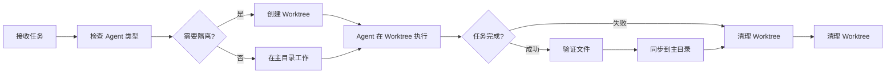
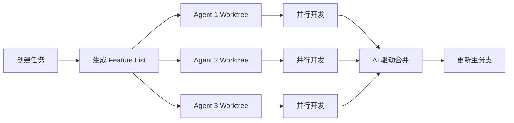

# Git Worktree 隔离机制对比分析

## 📊 SuperAgent vs Auto-Claude Worktree 机制

**分析日期**: 2026-01-11
**SuperAgent 版本**: v3.1
**Auto-Claude 版本**: 2.7.2

---

## ✅ 确认: SuperAgent 已实现 Git Worktree 保护机制

SuperAgent v3.1 **已经实现了**与 Auto-Claude 类似的 Git Worktree 隔离机制,用于保护主分支安全。

---

## 🏗️ 架构对比

### **SuperAgent v3.1 Worktree 架构**

```
┌─────────────────────────────────────────────────────────────┐
│ SuperAgent Git Worktree 隔离架构                            │
├─────────────────────────────────────────────────────────────┤
│                                                             │
│  项目根目录/                                                 │
│  ├── .git/ (主仓库)                                         │
│  ├── src/                                                   │
│  ├── tests/                                                 │
│  └── .worktrees/              ← Worktree 基础目录           │
│      ├── task-001/            ← 任务 1 隔离工作区            │
│      │   ├── .git/            (独立的 worktree)             │
│      │   └── [任务代码]                                     │
│      ├── task-002/            ← 任务 2 隔离工作区            │
│      │   └── [任务代码]                                     │
│      └── task-003/            ← 任务 3 隔离工作区            │
│          └── [任务代码]                                     │
│                                                             │
│  主分支 (main) 始终保持安全 ✅                              │
└─────────────────────────────────────────────────────────────┘
```

### **Auto-Claude Worktree 架构**

```
┌─────────────────────────────────────────────────────────────┐
│ Auto-Claude Git Worktree 隔离架构                           │
├─────────────────────────────────────────────────────────────┤
│                                                             │
│  项目根目录/                                                 │
│  ├── .git/ (主仓库)                                         │
│  ├── src/                                                   │
│  ├── tests/                                                 │
│  └── [worktrees]/             ← Worktree 基础目录           │
│      ├── agent-1-task-a/      ← 代理 1 工作区               │
│      ├── agent-2-task-b/      ← 代理 2 工作区               │
│      ├── agent-3-task-c/      ← 代理 3 工作区               │
│      └── ... (最多 12 个代理并行)                           │
│                                                             │
│  主分支 (main) 始终保持安全 ✅                              │
└─────────────────────────────────────────────────────────────┘
```

---

## 🔧 实现细节对比

### **1. 核心组件**

| 特性 | SuperAgent v3.1 | Auto-Claude |
|------|-----------------|-------------|
| **Worktree 管理器** | [`GitWorktreeManager`](../orchestration/worktree_manager.py:21) | 集成在主流程中 |
| **编排层** | [`WorktreeOrchestrator`](../orchestration/worktree_orchestrator.py:22) | 多代理协调器 |
| **配置模型** | [`WorktreeConfig`](../orchestration/models.py:193) | 动态配置 |
| **安全验证** | [`validate_path()`](../common/security.py) | 三层安全模型 |

---

### **2. SuperAgent Worktree 实现详解**

#### **核心文件结构**

```
SuperAgent/
├── orchestration/
│   ├── worktree_manager.py      # Git Worktree 管理器 (283 行)
│   ├── worktree_orchestrator.py # Worktree 编排器 (104 行)
│   └── models.py                # 数据模型 (WorktreeConfig)
├── common/
│   └── security.py              # 安全验证函数
└── tests/
    ├── unit/test_worktree_logic.py
    └── security/test_vulnerabilities.py
```

#### **核心类与方法**

##### **`GitWorktreeManager`** ([`worktree_manager.py:21`](../orchestration/worktree_manager.py:21))

```python
class GitWorktreeManager:
    """Git Worktree 管理器"""

    def __init__(self, project_root: Path, config: Optional[WorktreeConfig] = None):
        self.project_root = Path(project_root)
        self.config = config or WorktreeConfig()
        self.worktree_base = self.project_root / self.config.worktree_base

    def create_worktree(
        self,
        task_id: str,
        branch_name: Optional[str] = None,
        from_branch: Optional[str] = None
    ) -> Path:
        """创建新的 worktree (隔离工作区)"""

    def remove_worktree(self, worktree_path: Path) -> bool:
        """移除 worktree (带安全验证)"""

    def list_worktrees(self) -> List[dict]:
        """列出所有 worktree"""

    def prune_worktrees(self) -> bool:
        """清理无用的 worktree 记录"""

    def cleanup_all(self) -> int:
        """清理所有 worktree"""
```

**安全特性**:
- ✅ 路径验证: [`validate_path()`](../common/security.py) 防止路径穿越
- ✅ 分支名验证: [`validate_git_ref()`](../common/security.py) 防止注入攻击
- ✅ 隔离目录: 默认 `.worktrees/` 目录
- ✅ 自动清理: 完成后自动移除

##### **`WorktreeOrchestrator`** ([`worktree_orchestrator.py:22`](../orchestration/worktree_orchestrator.py:22))

```python
class WorktreeOrchestrator(BaseOrchestrator):
    """Worktree 业务逻辑封装"""

    async def create_for_task(self, task: TaskExecution, agent_type: str) -> None:
        """为任务创建隔离工作区"""

    async def sync_to_root(self, task: TaskExecution) -> None:
        """同步工作区更改到项目根目录"""

    async def cleanup_all(self) -> int:
        """清理所有工作区"""
```

**隔离的 Agent 类型**:
```python
isolated_agents = [
    "backend-dev", "frontend-dev", "database-design",
    "full-stack-dev", "qa-engineering", "code-refactoring",
    "devops-engineering", "mini-program-dev"
]
```

##### **`WorktreeConfig`** ([`models.py:193`](../orchestration/models.py:193))

```python
@dataclass
class WorktreeConfig:
    """Git Worktree 配置"""
    main_branch: str = "main"                   # 主分支名称
    worktree_base: str = ".worktrees"           # worktree 基础目录
    naming_pattern: str = "task-{task_id}"      # 命名模式

    # 配置选项
    auto_cleanup: bool = True                   # 自动清理
    force_prune: bool = False                   # 强制 prune
    track_branches: bool = True                 # 跟踪分支
```

---

### **3. 工作流程对比**

#### **SuperAgent 任务执行流程**



#### **Auto-Claude 并行执行流程**



---

## 🛡️ 安全机制对比

### **SuperAgent 三层安全模型**

| 层级 | 实现方式 | 代码位置 |
|------|----------|----------|
| **1. 路径验证** | [`validate_path()`](../common/security.py) | 防止路径穿越 |
| **2. 分支名验证** | [`validate_git_ref()`](../common/security.py) | 防止注入攻击 |
| **3. 隔离目录** | `.worktrees/` | 限制操作范围 |

**安全验证示例**:
```python
# worktree_manager.py:59-90
from common.security import validate_git_ref, validate_path, SecurityError

# 1. 验证分支名称
branch_name = validate_git_ref(branch_name)

# 2. 验证基础分支
from_branch = validate_git_ref(from_branch)

# 3. 验证 worktree 路径
worktree_path = validate_path(raw_worktree_path, self.worktree_base)
```

### **Auto-Claude 三层安全模型**

| 层级 | 实现方式 |
|------|----------|
| **1. OS 沙盒** | Bash 命令在隔离环境中运行 |
| **2. 文件系统限制** | 操作限制在项目目录内 |
| **3. 动态命令白名单** | 基于检测到的项目技术栈动态生成 |

---

## 📊 功能对比表

| 功能 | SuperAgent v3.1 | Auto-Claude | 优势方 |
|------|-----------------|-------------|--------|
| **Git Worktree 隔离** | ✅ | ✅ | 平手 |
| **并行执行** | ✅ (最多 3 个并行任务) | ✅ (最多 12 个代理) | Auto-Claude |
| **安全验证** | ✅ (路径+分支验证) | ✅ (三层安全模型) | 平手 |
| **自动清理** | ✅ | ✅ | 平手 |
| **主分支保护** | ✅ | ✅ | 平手 |
| **路径穿越防护** | ✅ | ✅ | 平手 |
| **分支名验证** | ✅ | ❌ (未明确) | SuperAgent |
| **任务隔离** | ✅ (8 种 Agent 类型) | ✅ (所有代理) | Auto-Claude |
| **可视化界面** | ❌ (CLI) | ✅ (Kanban 看板) | Auto-Claude |
| **AI 驱动合并** | ❌ | ✅ | Auto-Claude |
| **多域支持** | ✅ (代码+内容) | ❌ (仅代码) | SuperAgent |

---

## 🎯 使用场景对比

### **SuperAgent 适用场景**

```python
# 场景 1: 单任务隔离开发
from orchestration.worktree_manager import GitWorktreeManager
from orchestration.worktree_orchestrator import WorktreeOrchestrator

# 创建 worktree 管理器
worktree_mgr = GitWorktreeManager(project_root, config)

# 创建编排器
orchestrator = WorktreeOrchestrator(
    project_root,
    worktree_manager=worktree_mgr
)

# 为任务创建隔离工作区
await orchestrator.create_for_task(task, agent_type="backend-dev")

# 在隔离工作区执行任务...

# 同步到主目录
await orchestrator.sync_to_root(task)

# 清理工作区
await orchestrator.cleanup_all()
```

### **Auto-Claude 适用场景**

```
# 场景 1: 并行多代理开发
1. 创建任务 → 生成 feature_list.json
2. 启动 12 个代理 → 每个代理独立 worktree
3. 并行开发 → 互不干扰
4. AI 合并 → 自动冲突解决
5. 更新主分支 → 保持代码稳定
```

---

## 💡 关键差异总结

### **架构差异**

| 维度 | SuperAgent | Auto-Claude |
|------|------------|-------------|
| **设计哲学** | 编排层 + Worktree 管理器分离 | 多代理协调器集成 |
| **并行度** | 配置驱动 (max_parallel_tasks=3) | 固定上限 (12 个代理) |
| **粒度** | 任务级隔离 | 代理级隔离 |
| **合并策略** | 手动同步到主目录 | AI 自动合并 |
| **界面** | CLI | 桌面应用 (Electron) |

### **安全差异**

| 特性 | SuperAgent | Auto-Claude |
|------|------------|-------------|
| **路径验证** | ✅ 专用验证函数 | ✅ 文件系统限制 |
| **分支验证** | ✅ 专用验证函数 | ❌ 未明确 |
| **命令白名单** | ❌ | ✅ 动态白名单 |
| **OS 沙盒** | ❌ | ✅ |

---

## 🚀 建议

### **SuperAgent 可以向 Auto-Claude 学习的方面:**

1. **AI 驱动合并**
   - 实现自动冲突解决
   - 智能合并策略

2. **可视化进度管理**
   - 添加 Kanban 看板
   - 实时代理状态监控

3. **命令白名单机制**
   - 增强安全性
   - 防止意外命令执行

4. **提高并行度**
   - 从 3 个提升到 6-12 个
   - 优化并发控制

### **SuperAgent 已有优势:**

1. ✅ **多域支持** - 代码生成 + 内容生成
2. ✅ **分支名验证** - 更严格的安全验证
3. ✅ **灵活配置** - WorktreeConfig 可定制
4. ✅ **分层架构** - 编排层与管理器分离

---

## 📝 结论

**SuperAgent v3.1 已经实现了完整的 Git Worktree 隔离机制**,与 Auto-Claude 在保护主分支方面的核心能力一致。

### **核心相似点:**
- ✅ 都使用 Git Worktree 隔离主分支
- ✅ 都有自动清理机制
- ✅ 都有安全验证

### **主要差异:**
- 🔄 **并行度**: Auto-Claude 更多 (12 vs 3)
- 🎨 **用户界面**: Auto-Claude 有桌面应用
- 🌐 **多域支持**: SuperAgent 更强
- 🔒 **分支验证**: SuperAgent 更严格

### **适用建议:**
- **SuperAgent**: 适合需要多域扩展、高度定制化的场景
- **Auto-Claude**: 适合需要高并发、可视化管理的纯代码开发场景

---

## 🔗 相关文件

- [GitWorktreeManager](../orchestration/worktree_manager.py)
- [WorktreeOrchestrator](../orchestration/worktree_orchestrator.py)
- [WorktreeConfig](../orchestration/models.py#L193)
- [安全验证函数](../common/security.py)
- [单元测试](../tests/unit/test_worktree_logic.py)

---

**文档版本**: v1.0
**最后更新**: 2026-01-11
